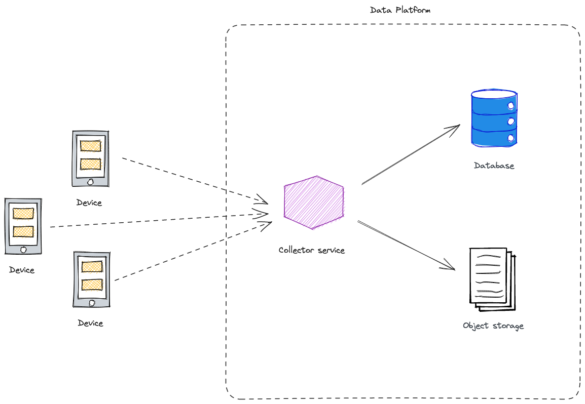

### Why it matters?
- scalable and cost-efficient solution, with proper configuration both storage and processing tiers are decoupled and highly optimized,
- solution suits both structured and unstructured data, which is desired for both analytical as engineering workloads,
- with good design you don't need dedicated databases or data warehouse

### What you will learn?
- how certain AWS services play together to provide a serverless data platform,
- no-code approach to deliver infrastructure capable of collecting, transforming and querying underlying data almost free of charge,
- practical difference between representing files in JSON and Parquet format
---

> This article is a part of **"Practical Data Platform on Amazon AWS 📊"** series:
> 1. **Ingest and query data** [`AWS Kinesis Firehose Delivery`, `AWS Glue`]
> 2. Data organization [`Apache Iceberg`]
> 3. Forming lake with [`AWS LakeFormation`]
> 4. Data modelling with dbt (duckdb for staging layer)
> 5. Federated queries using Trino (maybe pushing to Redshift?)
> 6. Monitoring data quality [`AWS Glue`]
> 7. Semantic modelling with [`Cube.js`]
> 8. Real-time data deduplication

---

# Background

For the rest of the series we assume that we are working in IoT domain, where certain devices emit a continuous stream of sensor readings:

```
...
{'sensor_id': 4, 'measure': 151.46, 'event_time': '2023-07-21 03:28:29.000000'}
{'sensor_id': 4, 'measure': 139.5, 'event_time': '2023-07-20 20:45:02.000000'}
{'sensor_id': 8, 'measure': 170.06, 'event_time': '2023-07-20 23:44:47.000000'}
{'sensor_id': 4, 'measure': 136.36, 'event_time': '2023-07-22 17:52:08.000000'}
{'sensor_id': 8, 'measure': 166.61, 'event_time': '2023-07-22 17:36:13.000000'}
{'sensor_id': 0, 'measure': 138.95, 'event_time': '2023-07-20 16:09:26.000000'}
...
```

There are 10 distinct sensor IDs, each of them emit a random temperature reading with a certain status assigned ([source](https://github.com/khozzy/aws-data-lake/blob/646857c5a685b6d60a548b6bd7b9457d07c73091/code/gen_temp.py)). In each case we will limit ourselves to 25,000 data samples, which should be representative enough.

For the purpose of analysis (assume the anomaly detection) we are interested in:

```sql
-- (1) average temperature readings for each sensor
SELECT sensor_id, avg(measure) FROM sensors_json GROUP BY 1 ORDER BY 1;

-- (2) readings from particular day
SELECT measure FROM sensors WHERE sensor_id = 2 AND event_time = '2023/07/05';
```

# Layman's architecture
The first approach might involve creating a dedicated service process exposing a HTTP collector endpoint, performing initial data processing and pushing it downstream for storage (database or file system).



This solution would work, but it has a few major downsides:
- scalability issues (provisioned resources might not handle excess traffic),
- maintenance burden (each new proprietary component increases the system's complexity)
- wheel reinvention (handle exceptions and communication with other components)

While such solution might be good for early prototyping we won't benchmark it. In all other subsequent examples we will utilize [AWS Kinesis Data Firehose](https://docs.aws.amazon.com/firehose/latest/dev/basic-deliver.html) service for ingesting the payload, [AWS Glue](https://aws.amazon.com/glue/) for storage and [AWS Athena]() for querying.

# JSON format
Let's start with the very basic setting of Kinesis Firehose Delivery Stream - we will buffer and dump incoming messages into the S3 bucket in JSON format.

```terraform
resource "aws_glue_catalog_table" "sensors_json" {
  database_name = aws_glue_catalog_database.glue_db.name
  name          = "sensors_json"

  table_type = "EXTERNAL_TABLE"

  parameters = {
    "EXTERNAL" : "true",
    "classification" : "json"
  }

  partition_keys {
    name = "sensor_id"
    type = "int"
  }

  partition_keys {
    name = "dt"
    type = "string"
  }

  storage_descriptor {
    location      = "s3://${aws_s3_bucket.sink.id}/sensors_raw/json/"
    input_format  = "org.apache.hadoop.mapred.TextInputFormat"
    output_format = "org.apache.hadoop.hive.ql.io.HiveIgnoreKeyTextOutputFormat"

    ser_de_info {
      serialization_library = "org.openx.data.jsonserde.JsonSerDe"
    }

    columns {
      name = "measure"
      type = "float"
    }

    columns {
      name = "event_time"
      type = "timestamp"
    }
  }
}
```

There are some non-trivial things going on here already.

By default, Kinesis Data Firehose buffers incoming payload by concatenating them. So, for a series of incoming JSON messages, the file dropped on S3 might have the following structure

```
{...}{...}{...}
```

This is problematic because it does not meet the requirements for the properly formatted JSON file and might impact downstream processes. Tools like AWS Athena will continue to operate, but will give the incorrect results, which might be tricky to spot at first. In past there were workaround including creating a custom Lambda functions adding delimiters to records, but now this task is as simple as configuring the delivery stream properly with proper _data processors_.

We will enable two processors - `AppendDelimiterToRecords` (which solves the aforementioned problem) and `MetadataExtraction` that parses each payload and extract the specific attribute.

The latter will be used to construct the Hive-like file path that will enable us the "_predicate projection_" feature boosting query speed. By design, we store readings stemming from particular sensor in its own directory. 
```
s3://<bucket>/sensors_raw/json/sensor_id=0/dt=2023-07-06/<file_name>
```

In order for this setting to work you need to enable the dynamic partitioning configuration and specify the file path accordingly. Notice, that the path is also composed of `dt=` prefix, which stands for the "message processing timestamp" (not the event generation timestamp).

See if everything work as intended by inspecting the first few lines of file dump and the overall bucket storage stats:

```bash
$ aws s3 cp s3://<bucket>/sensors_raw/json/sensor_id=0/dt=2023-07-06/<file> - | head

{"sensor_id": 0, "measure": 135.77, "event_time": "2023-07-09 08:49:01.000000"}
{"sensor_id": 0, "measure": 159.66, "event_time": "2023-07-08 13:27:15.000000"}
{"sensor_id": 0, "measure": 150.73, "event_time": "2023-07-08 15:39:51.000000"}
{"sensor_id": 0, "measure": 149.79, "event_time": "2023-07-08 12:17:14.000000"}
{"sensor_id": 0, "measure": 144.56, "event_time": "2023-07-07 19:06:45.000000"}
{"sensor_id": 0, "measure": 122.04, "event_time": "2023-07-07 00:57:13.000000"}
{"sensor_id": 0, "measure": 146.29, "event_time": "2023-07-08 07:57:54.000000"}
{"sensor_id": 0, "measure": 153.47, "event_time": "2023-07-09 03:54:52.000000"}
{"sensor_id": 0, "measure": 152.16, "event_time": "2023-07-06 19:12:54.000000"}
{"sensor_id": 0, "measure": 123.66, "event_time": "2023-07-06 20:13:30.000000"}
```

```bash
$ aws s3 ls s3://<bucket>/sensors_raw/json/ --recursive --human-readable --summarize

# ...
Total Objects: 200
Total Size: 1.9 MiB
```

To query the data, we first need to provide an AWS Glue table definition which will be later used in AWS Athena.

```terraform
resource "aws_glue_catalog_table" "sensors_json" {
  database_name = aws_glue_catalog_database.glue_db.name
  name          = "sensors_json"

  table_type = "EXTERNAL_TABLE"

  parameters = {
    "EXTERNAL" : "true",
    "classification" : "json"
  }

  partition_keys {
    name = "sensor_id"
    type = "int"
  }

  partition_keys {
    name = "dt"
    type = "string"
  }

  storage_descriptor {
    location      = "s3://${aws_s3_bucket.sink.id}/sensors_raw/json/"

    ser_de_info {
      serialization_library = "org.openx.data.jsonserde.JsonSerDe"
    }

    columns {
      name = "measure"
      type = "float"
    }

    columns {
      name = "event_time"
      type = "timestamp"
    }
  }
}
```

- We are specifying the partition keys constituting the object path (used for the later _"predicate pushdown"_) as well as the regular data table columns,
- We set the `EXTERNAL` property, indicating that the table metadata is stored inside AWS Glue Data Catalog but the data reside in external data source (S3 in this case).

Before querying the table, partitions metadata need to be refreshed. Make it happen with executing either Athena query:
- `MSCK REPAIR TABLE sensors_json;` to automatically discover the partition structure,
- or manually for each directory `ALTER TABLE sensors_json ADD PARTITION (sensor_id="...", dt="...") LOCATION "s3://..."` 

### Query performance
```sql
SELECT
    sensor_id,
    avg(measure)
FROM sensors_json
GROUP BY 1
ORDER BY 1;

-- Time in queue: 146 ms    Run time: 916 ms    Data scanned: 1.84 MB
```

```sql
SELECT avg(measure)
FROM sensors_json
WHERE date(event_time) = date('2023-07-22') AND sensor_id = 1;

-- Time in queue: 120 ms    Run time: 846 ms    Data scanned: 201.20 KB
```

# Parquet format
We start with configuring Kinesis Data Firehose, which is very similar to the previous example. The main difference is that we are utilizing the _"Record format conversion"_ feature enabling real-time data conversion between formats (in this case JSON to Parquet).

Notice the `parquet_ser_de` [output serializer configuration](https://docs.aws.amazon.com/firehose/latest/APIReference/API_ParquetSerDe.html) block allowing to specify things like the compression or the HDFS block size. However, to make the comparison more fair we will retain the default settings.

```terraform
resource "aws_kinesis_firehose_delivery_stream" "parquet_firehose_stream" {
  # ...
 
  data_format_conversion_configuration {
    input_format_configuration {
      deserializer {
        hive_json_ser_de {}
      }
    }

    output_format_configuration {
      serializer {
        parquet_ser_de {}
      }
    }

    schema_configuration {
      database_name = aws_glue_catalog_database.glue_db.name
      table_name    = aws_glue_catalog_table.sensors_parquet.name
      role_arn      = aws_iam_role.firehose_delivery_role.arn
    }
  }

  # ...
}
```

After sending the same number of records as before, let's peek at state of the files in the sink directory

```bash
$ aws s3 ls s3://<bucket>/sensors_raw/parquet/ --recursive --human-readable --summarize

# ...
Total Objects: 198
Total Size: 365.5 KiB
```

Wow, there is a first huge thing already - 5x more efficient storage utilization. We went from 1.9 MiB to 350 KiB for the same data volume.

But that is not everything, notice the data scanned for the queries sourcing a new table.

```sql
SELECT
    sensor_id,
    avg(measure)
FROM sensors_parquet
GROUP BY 1
ORDER BY 1;

-- Time in queue: 131 ms    Run time: 992 ms    Data scanned: 106.83 KB
```

```sql
SELECT avg(measure)
FROM sensors_parquet
WHERE date(event_time) = date('2023-07-22') AND sensor_id = 1;

-- Time in queue: 134 ms    Run time: 835 ms    Data scanned: 31.67 KB
```

In case of the first query Athena is utilizing the Parquet's _"projection pushdown"_ capability allowing it to scan only relevant columns. In this case only `measure` is considered, since `sensor_id` is a partition key. Because Athena's pricing model is a function of the data scanned, that has a direct implication on the final AWS bill.

## Closing thoughts
We saw that AWS Kinesis Data Firehose provides a surprisingly simple mechanism for scalable data storage. By utilizing the _"dynamic partitioning"_ we can leverage of the _"predicate pushdown"_ by physically organizing rows into directories.

Then, we enabled the _"Record format conversion"_ feature, transforming data into as Parquet files. This allows us to take the next advantage of the _"projection pushdown"_ feature - only file's blocks containing relevant data was scanned.

There are still some Parquet tricks that might be configured, such as the compression or sorting within the file that can speedup the desired query.

Presented solution is still not perfect:
- significant amount of small files created in each directory (result of setting the buffering window),
- data is partitioned by the processing timestamp (`dt`), but it would make more sense to use the `event_time` from the payload instead.

---
The code for reproduction is free and available [here](https://github.com/khozzy/aws-data-lake/tree/master)


? DUPLICATES