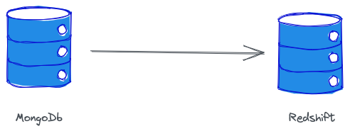

## Introduction
While there is multiple ways for performing data munging I recently tried to use [DuckDb](https://duckdb.org/) to deliver a simple transformation pipeline between two different databases.

This blog post will delve into the process of such integrations. Tools like Jupyter Lab enable interactive data analysis and detailed code examples illustrates each step. 

By the end of this post, you will be well-equipped to leverage the power of DuckDb and Python for your data transformation tasks.

## Let's start with 'why?'
- save time for mundane tasks like changing data formats (DuckDdb can read/write CSV,JSON, Avro, Parquet seamlessly)
- use declarative language of SQL instead of imperative code instructions
- ability to efficiently visualize data on the fly in the interactive notebook (in-memory OLAP db)

## Why not?
- periodic data transformation might be tricky?

## Scenario
In this case I assume that we would like to move data from MongoDb into Redshift cluster.

## Conclusion
Consider automating the process with tools like AWS Step Functions.