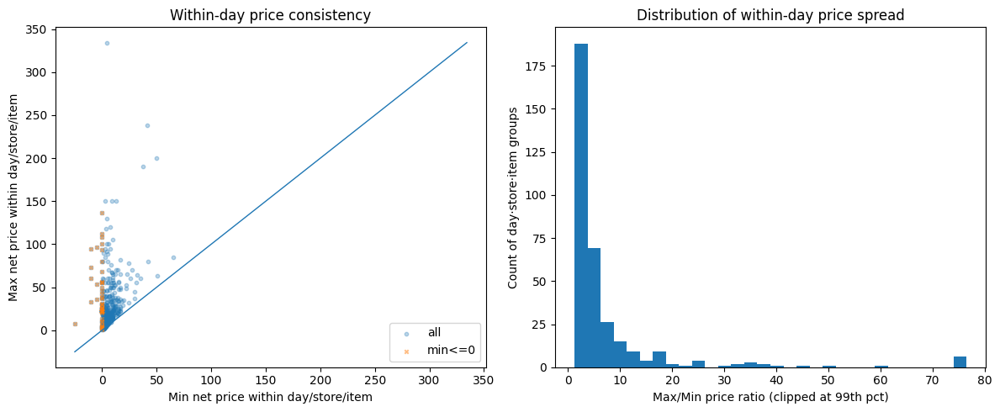
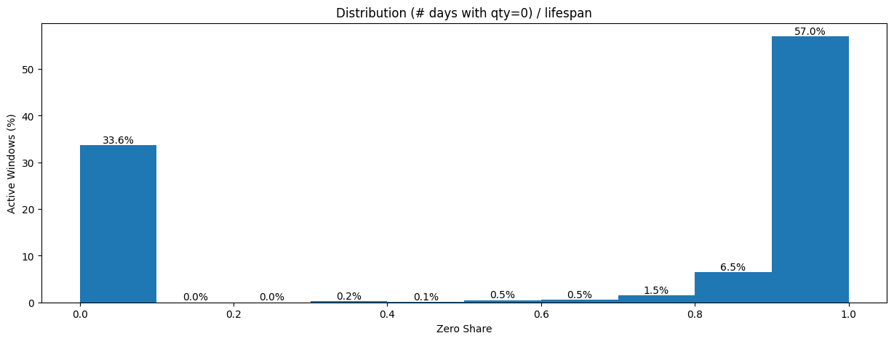

A client handed me 1.5 million rows of point-of-sale data from a pet retail chain. ~60 stores, 20,000+ products, a full year of transactions. The ask was straightforward: build daily demand forecasts.

It was tempting to jump straight into SageMaker. The dataset was there, the infrastructure was ready, and AutoML promises to handle feature engineering, model selection, and hyperparameter tuning for you. Point it at a CSV, define your target column, and let it run. You'd have a leaderboard of candidate models by end of day.

I almost did exactly that. Instead, I spent a week on EDA first.

That week saved months of wasted work. The EDA told me the forecasting plan was wrong — not "the data needs cleaning" wrong. Structurally wrong — the kind of wrong where AutoML would diligently train, tune, and deploy models that produce confident predictions. Predictions that would quietly mislead inventory decisions for months before anyone noticed.

This post walks through what I found, why it mattered, and how it redirected the entire project. If you're building demand forecasts on retail data, these are the checks you should run before writing a single line of model code.


- **746 duplicate keys** from a flawed POS export — inventory adjustments mixed with real sales
- **Pricing identity failures** up to 75x within the same day-store-item
- **10 ghost stores** with no data on most days, silently biasing demand downward
- **66% of demand series classified as lumpy** (Syntetos-Boylan framework) — unforecastable with standard models
- **Only 39 out of ~199K store-item pairs** had truly continuous demand
- **Strategic pivot**: forecast weekly categories, not daily items


*Written by [Norbert Kozlowski](/) — data engineer with 15 years of experience and a Ph.D. in AI. I write about the decisions that matter before you train a model. [Get the EDA toolkit →](#get-the-complete-demand-forecasting-eda-toolkit)*

## The Setup

The dataset was a CSV export of order records from their POS system — roughly 330MB, covering September 2024 through September 2025. Each row represented a transaction line: a product sold at a specific store on a specific date.

After renaming columns, dropping identifiers, and basic cleaning, the working dataset looked like this:

| Column | Description |
|--------|-------------|
| `date` | Transaction date |
| `store_id` | Store identifier (with `multi_store_id` as parent hierarchy) |
| `item_id` | Product identifier |
| `item_brand` | Brand name (~630 distinct brands) |
| `item_category` | Extracted from breadcrumb hierarchy |
| `item_unit_price` | Listed unit price |
| `item_unit_net_price` | Net price per unit |
| `item_discount_amount` | Discount applied |
| `item_promo_applied` | Whether a promotion was active (binary) |
| `demand` | Quantity sold — the target variable |

**1.5M rows. 13 columns. ~60 stores. ~20K items.**

The forecasting grain was `(date, store_id, item_id)` — predict how many units of a specific product will sell at a specific store on a given day.

For any time-series forecasting problem, it helps to think about your features in three categories:

- **Target**: `demand` — units sold per day per store per item
- **Static covariates** (properties of the series that don't change over time): store hierarchy (`multi_store_id`, `store_id`, `store_town`, `store_postcode`), item hierarchy (`item_id`, `item_brand`, `item_category`)
- **Dynamic known covariates** (features that change over time and can be known in advance): `item_promo_applied`, `item_unit_net_price`

This distinction matters because static covariates let the model learn that "stores in the same region behave similarly" or "items in the same category share demand patterns." Dynamic covariates let it learn that "when this item goes on promotion, demand jumps." SageMaker's DeepAR and AutoML both support this structure — you just need the data to be clean enough to carry the signal.

Sounds straightforward. It wasn't.

## Sanity Checks: Where the Cracks Appeared

### Duplicate keys

The first check was uniqueness of the series key. If `(date, store_id, item_id)` is supposed to be our prediction grain, each combination should appear exactly once.

It didn't. **746 groups had duplicate rows.** Left uncleaned, these duplicates would inflate demand counts for some products and zero out others — corrupting the target variable in ways that look plausible. Some had two entries, some had three. Looking at a specific example — same store, same item, same date — one row had a normal price and 1 unit sold, the other had `unit_price = 0`, no net price, and `demand = 0`.

The root cause turned out to be the export query itself. The software engineers who built the data extract didn't fully understand the POS database layout. The underlying tables had multiple record types — actual sales, inventory adjustments, manual corrections — distinguished by conditions they hadn't accounted for in their joins. The query mixed these together, producing duplicate keys where a real sale and an inventory event for the same product on the same day got exported as two separate rows.

This is a common trap. The people who build the export are rarely the people who'll use the data for modeling. They write a query that looks correct, produces reasonable row counts, and passes a spot check. But subtle join conditions — the difference between a sale record and an adjustment record, or how the system distinguishes a return from a void — are domain knowledge buried in the database schema. Without it, you get a dataset that looks clean but carries structural duplicates that silently corrupt your target variable.

### Negative demand and discounts

- **55 rows** with negative demand (likely returns)
- **2,672 rows** with negative discounts (surcharges? data entry errors?)
- A small fraction (~0.001%) of non-integer demand — not a bug, these were weight-based items

Individually, each of these is minor. Together, they signal: the data pipeline between POS and analytics wasn't designed with forecasting in mind. It was designed for financial reporting, where these edge cases net out in aggregation. For time-series forecasting, they don't.

I bounced this back to the development team to investigate. The negative demand rows and negative discounts weren't something we could resolve from the data alone — they needed someone with access to the POS system's business logic to confirm whether these were returns, voids, surcharges, or export artifacts. This is the kind of finding that EDA surfaces early, before it becomes a silent bias baked into a deployed model.

### Promotions without discounts

Some rows were flagged as promotional (`item_promo_applied = 1`) but had zero discount. If you're planning to use promotion status as a covariate — and you should, since promos are the strongest demand lever in retail — this undermines the signal. Is the promo flag unreliable? Or do some promotions not involve price discounts (e.g., shelf placement, bundling)?

Without knowing which, the feature is noisy at best and misleading at worst.

### Pricing identity failures

I expected a simple identity to hold: `unit_price - discount ≈ net_price`. It didn't. Certain stores showed systematic pricing mismatches over time, visible as clear spikes when plotted. The worst offenders had consistent errors across months — suggesting a configuration issue in the POS system rather than random noise.

When I checked within-day price consistency for the same item at the same store, the results were worse. For every `(date, store_id, item_id)` group with multiple rows, I computed the max/min price ratio. Most flagged groups had ratios in the 2-5x range, but the distribution had a long tail stretching to 75x and beyond. A significant cluster of cases had minimum prices at or below zero — returns, voids, or inventory adjustments dragging the floor price negative while the max reflected the normal shelf price. The typical causes: line-level vs. basket-level discounts recorded differently, mixed pack sizes under one product ID, returns posted as negative price lines.

Why it matters? If your model learns "when price drops, demand rises," but the price data is incoherent, the model is learning noise. Price elasticity estimates become meaningless.

### The POS system wasn't used for what we thought

As the sanity checks accumulated, a pattern emerged: this wasn't just "messy data." The client was using their POS system in ways it wasn't designed for — or more precisely, in ways that make perfect sense for running a store but break assumptions that forecasting models depend on.

A few examples:

- **Product renaming without new IDs.** Staff would rename items in the POS (correcting typos, updating descriptions) while keeping the same SKU and product ID. From a store operations perspective, nothing changed — it's the same product on the same shelf. From a data perspective, the "comment" field (which carried the product name and variant) became inconsistent across time for the same `item_id`. If you'd used product names for deduplication or matching, you'd have phantom product splits.
- **Inventory adjustments recorded as transactions.** Stock corrections, write-offs, and inter-store transfers appeared in the same transaction stream as actual customer purchases. Some zero-demand rows with `unit_price = 0` weren't sales at all — they were inventory events masquerading as demand data.
- **Manual price overrides.** Some items had `unit_price = 0` because the cashier entered the price manually at the register rather than scanning a barcode. The system recorded a transaction, but without a reliable price. These rows still contributed to aggregate demand counts.

None of these are bugs. They're the reality of how a multi-store retail operation uses its POS day-to-day. But they're invisible if you skip EDA and feed the CSV straight into AutoML. SageMaker would happily treat inventory adjustments as demand signals and manual price overrides as price drops. The resulting forecasts would be confidently wrong.



## How Missing Store Data Biases Demand Forecasts

Next, I looked at whether stores reported data consistently.

Most stores carried between 2,500 and 4,000 distinct items over the dataset period, with the peak around 3,500. But 5-6 stores had fewer than 500 items — an order of magnitude less than the typical store. These outliers immediately raised questions: are these genuinely small locations, or stores with broken data exports?

I built a date spine — every day in the date range, crossed with every store — and checked for gaps. About 10 stores had **no data on most days**. Not low sales. No data at all. These weren't closed stores (they appeared sporadically), they were stores with unreliable POS reporting. The same stores that showed suspiciously low item counts were the ones with the most missing days. Weekends showed predictable dips across all stores, but the real signal was the stores that were structurally absent.

If you include these stores in training, you're teaching the model that "no data = no demand." But "no data" and "zero demand" are fundamentally different things. One means the store was closed or the system was down. The other means products were available and nobody bought them. Confusing the two produces a forecast that's systematically biased downward.

## Why Was 66% of Demand Unforecastable?

This is where the project pivoted.


**Intermittent demand** occurs when a product experiences long periods of zero sales punctuated by sporadic, unpredictable purchases. In retail, this is common for long-tail products — items that are listed and available but sell only a handful of times per quarter. Standard forecasting models (ARIMA, Prophet, DeepAR) assume reasonably continuous demand signals and perform poorly on intermittent series. The Syntetos-Boylan Classification (SBC) further distinguishes intermittent demand from **lumpy demand**, where both the timing and quantity of sales are unpredictable.


Every forecasting problem has an implicit assumption: the thing you're predicting happens often enough to learn patterns from. For demand forecasting, that means products need to sell with some regularity. But how regular is "enough"?

### Measuring the active window

I computed the "active window" for each store-item combination — the contiguous period between when an item first appeared at a store and when it last appeared. This is the window where that item was listed, available, and theoretically purchasable. Then I measured the "zero share" — the fraction of days within the active window that had no sales.

The numbers were stark:

| Metric | Value |
|--------|-------|
| Average lifespan | **133 days** |
| Average days with sales | **7.6 days** |
| Average activity rate | **0.38** (mean of per-window ratios — short-lived items with near-daily sales pull this up) |

A typical product is listed at a store for over four months, but only sells on 7-8 of those days.

The zero-share distribution told the real story — and it was bimodal.

**57% of all active windows had a zero share near 1.0**, meaning almost every day within the window had no sales. On the other end, **33.6% had a zero share near 0.0** — items that sold on most days they were listed. Almost nothing fell in between. The dataset wasn't "a bit sparse." It was two completely different populations masquerading as one.

When I plotted zero share against lifespan, the pattern crystallized.

 exist almost exclusively for short-lived listings. Once an item has been listed for more than ~50 days, its zero share converges to 0.95-1.0.")

As an item's lifespan exceeds ~50 days, its zero share converges to 0.95-1.0. The longer an item stays listed, the more intermittent it looks. Items with short lifespans (<10 days) showed more variation — some sold every day of their brief life, others sold once and then disappeared. But for anything listed more than a couple of months, the trajectory was almost deterministic: the zero share approached 0.97 and stayed there.

This distinction between "listed" and "selling" is critical. The dataset doesn't contain rows for days when nothing sold — there's no explicit zero. If you naively fill missing dates with `demand = 0`, you're assuming every item was available every day of its active window. But some of those zero-demand days might be stockouts (product unavailable), not lack of customer interest. Without inventory-on-hand data, you can't tell the difference — and that distinction is everything for a forecast.

A rule-based classification drove the point home: of ~199K active windows, **196,217 (98.6%) were highly intermittent**, 2,718 (1.4%) were intermittent, and just 39 (0.0%) qualified as continuous demand. Only 39 store-item pairs out of nearly 200,000 sold consistently enough to use standard forecasting methods without modification.

### Syntetos-Boylan Classification


The **Syntetos-Boylan Classification (SBC)** is a framework from operations research that categorizes demand patterns into four types — smooth, erratic, intermittent, and lumpy — based on two dimensions: how frequently demand occurs (average inter-demand interval, or ADI) and how variable the demand size is when it does occur (coefficient of variation squared, or CV²). Originally proposed by [Syntetos and Boylan (2005)](https://doi.org/10.1016/j.ijforecast.2004.10.001) in the *International Journal of Forecasting*, SBC directly prescribes which forecasting method to use for each demand pattern.


To understand not just *how often* items sell but *how they sell*, I reached for a standard framework from operations research: the **Syntetos-Boylan Classification (SBC)**. It classifies demand patterns along two dimensions:

- **Average inter-demand interval (ADI)** — how long between consecutive non-zero demand events
- **Coefficient of variation of demand size (CV²)** — how variable the non-zero quantities are when sales do occur

This produces four quadrants:


quadrantChart
    title Syntetos-Boylan Classification
    x-axis "Low CV2" --> "High CV2"
    y-axis "Low ADI" --> "High ADI"
    quadrant-1 Lumpy
    quadrant-2 Intermittent
    quadrant-3 Smooth
    quadrant-4 Erratic


| Quadrant | What it means | Best method |
|----------|---------------|-------------|
| **Smooth** | Sells often, consistent quantities | Standard methods (ETS, ARIMA) |
| **Erratic** | Sells often, but wildly varying quantities | Standard methods with caution |
| **Intermittent** | Sells rarely, but consistent when it does | Croston's method |
| **Lumpy** | Sells rarely AND in unpredictable quantities | SBA, ADIDA |

The SBC framework matters because it directly prescribes the modeling approach. You don't pick a forecasting method based on what's trendy or what your cloud provider offers — you pick it based on your demand pattern.

When I classified the ~199K store-item pairs, the results were stark and surprisingly clean:

 are virtually empty.")

Two-thirds of all store-item combinations were **lumpy** — selling rarely AND in unpredictable quantities when they did sell. The remaining third was **smooth**. The middle quadrants (erratic and intermittent) were virtually empty. This dataset didn't have a spectrum of demand patterns. It had two modes: items that sell predictably, and items that barely sell at all.



### The Pareto reality

A Lorenz curve of sales volume completed the picture.

 vs. cumulative share of total demand. The color gradient maps zero share — green (continuous demand) dominates the high-volume head, red (highly intermittent) fills the long tail. The dotted line marks the 80/20 split.")

Just **19% of store-item windows generate ~80% of total demand volume** — this segment carries the business. The gap between the Lorenz curve and the equality line is enormous, confirming extreme concentration. After ~70-80% of the population, adding more windows yields tiny incremental volume — diminishing returns in textbook form.

The color gradient tells the strategic story. The high-volume head (green) maps almost exclusively to smooth-demand items with low zero share. The long tail (red) is the lumpy, highly intermittent population. This suggests a natural Pareto tiering: **A-tier** (top ~80% of volume) aligns with smooth demand, **B-tier** (next ~15%) is the transition zone, and **C-tier** (the tail) is dominated by lumpy items that sell rarely and unpredictably.

**This is the strategic paradox: the items that are easiest to forecast are the ones where forecasting adds the least value.** The smooth, high-volume A-tier items? The store already knows they need to restock those. The items that are hardest to forecast — lumpy, low-volume, C-tier — are exactly the ones where a good forecast would matter most. And those are the ones where standard models fail.

### Why this kills standard models

**This is the finding that changed the project direction.** Standard time-series models (ARIMA, Prophet, even neural forecasters like DeepAR) assume reasonably continuous demand signals. Their loss functions minimize error across all timesteps equally — which means thousands of correctly-predicted zeros dominate the gradient, drowning out the signal from the rare non-zero events that actually matter for inventory. When 66% of your series are lumpy — mostly zeros with occasional unpredictable spikes — these models either:

1. **Predict near-zero every day** — technically accurate (the mode is zero), practically useless for inventory planning
2. **Overfit to the rare non-zero events** — learn noise rather than signal
3. **Smooth everything into a meaningless average** — predict 0.05 units/day, which is neither zero nor one

None of these help someone decide how much stock to order. And if you'd fed this data into SageMaker AutoML without understanding the intermittency structure, this is exactly what you'd get — a well-tuned model that's confidently useless.

The right methods for lumpy and intermittent demand work differently. **[Croston's method](https://doi.org/10.2307/3008279)** (1972) decomposes the problem into two separate forecasts: one for the inter-demand interval (when will the next sale happen?) and one for the demand size (how much will sell when it does?). **SBA (Syntetos-Boylan Approximation)** corrects Croston's upward bias. **ADIDA (Aggregate-Disaggregate Intermittent Demand Approach)** temporally aggregates the data to reduce zeros, forecasts at the aggregate level, then disaggregates back. These aren't exotic — they're the standard toolkit for this exact problem. But you only reach for them if you know your demand is lumpy. And you only know that if you do the EDA.


| Method | Best For | How It Works | Limitation |
|--------|----------|-------------|------------|
| **ARIMA/ETS** | Smooth demand (daily+ frequency) | Models trend and seasonality in continuous series | Fails on series dominated by zeros |
| **Croston's** | Intermittent demand (consistent qty) | Separate forecasts for inter-demand interval and demand size | Upward bias on lumpy data |
| **SBA** | Lumpy demand | Croston's with bias correction | Still requires enough non-zero observations |
| **ADIDA** | Highly intermittent/lumpy | Aggregates temporally to reduce zeros, forecasts, disaggregates | Loses daily-level granularity |
| **DeepAR/AutoML** | Large-scale smooth demand | Neural network learns across related series | Optimizes for zeros in sparse data; misses rare events |


## What the Data Told Us

The EDA pointed to three strategic shifts, all visible before any model was trained — and all invisible to AutoML:

### 1. Don't forecast daily — forecast weekly

Daily demand for most items is a stream of zeros with occasional ones. Weekly aggregation compresses the sparsity. An item selling 7 times in 133 days (~0.05/day) becomes ~0.37/week — still sparse, but meaningfully different from zero in more periods. The forecast becomes "this item sells about once every 2-3 weeks at this store" rather than "zero, zero, zero, zero, one, zero, zero..."

This also aligns better with how the business actually uses forecasts. Nobody restocks daily. Replenishment cycles are weekly at best. Calendar features (day-of-week effects, payday proximity, holidays) showed meaningful patterns at the aggregate level — but for individual items selling 7 times in 4 months, they add noise rather than signal. Weekly aggregation is the right level for those patterns to help.

### 2. Don't forecast items — forecast categories

With 20,000+ items and 66% falling into lumpy demand, the signal is at the category level. A store might sell an unpredictable mix of specific dog food brands on any given week, but the total "dry dog food" category has a smoother, more forecastable demand curve. Forecast the category, then allocate downward based on historical item-level shares.

The static covariates — brand, category, store hierarchy — become more useful here. Instead of trying to learn patterns for 20K sparse item-level series, the model learns category-level demand shaped by store characteristics.

### 3. Match the method to the demand pattern

The Syntetos-Boylan Classification gave us a clean split: 33.6% smooth, 66.3% lumpy. The smooth items can use standard methods — and since they drive 80% of volume, that covers most of the revenue. The lumpy items need ADIDA or should be aggregated to a higher hierarchy. SageMaker's DeepAR can technically handle zeros, but it's overkill when the demand pattern is structurally intermittent rather than complex — and it won't outperform purpose-built intermittent demand methods on this type of data.



## Frequently Asked Questions

### How do you know if demand data is too intermittent to forecast?

Compute the **zero share** — the fraction of days with no sales within each product's active listing window. If more than 50% of your store-item pairs have a zero share above 0.9, standard time-series models will underperform. Use the [Syntetos-Boylan Classification](#syntetos-boylan-classification) to formally categorize demand patterns into smooth, erratic, intermittent, or lumpy — each category prescribes a different forecasting method.

### Why shouldn't you use AutoML for demand forecasting without EDA?

AutoML optimizes within the problem you define — it doesn't validate whether you've defined the right problem. Without EDA, you risk training on inventory adjustments masquerading as demand, learning from incoherent pricing data, and predicting daily demand for items that sell seven times a quarter. The model will produce confident predictions that quietly mislead inventory decisions.

### What is the best forecasting method for lumpy demand?

For lumpy demand — products that sell rarely and in unpredictable quantities — use [Croston's method](https://doi.org/10.2307/3008279), the Syntetos-Boylan Approximation (SBA), or ADIDA (Aggregate-Disaggregate Intermittent Demand Approach). Standard models like ARIMA and Prophet assume continuous demand and will either predict near-zero every day or smooth everything into a meaningless average. See the [method comparison table](#why-this-kills-standard-models) above.

### Should you forecast daily or weekly demand in retail?

For most retail products, weekly forecasting outperforms daily. Daily demand for long-tail items is a stream of zeros with occasional ones — models can't learn meaningful patterns from that signal. Weekly aggregation compresses the sparsity and aligns with actual replenishment cycles. An item selling 7 times in 133 days becomes ~0.37/week rather than ~0.05/day — still sparse, but meaningfully different from zero in more periods.



## The Takeaway

If I'd pointed SageMaker AutoML at this dataset on day one, it would have delivered results by end of week. A leaderboard of models, ranked by RMSE or MAPE, with the winning model deployed behind an endpoint. And every single one of those models would have been solving the wrong problem — trained on inventory adjustments masquerading as demand, learning price elasticities from incoherent pricing data, predicting daily demand for items that sell seven times a quarter.

AutoML is a powerful tool. But it optimizes within the problem you define. It doesn't tell you whether you've defined the right problem.

EDA isn't a checkbox you tick before the "real work" of model training. For demand forecasting, **the EDA is the strategic decision layer.** It tells you:

- Whether your data actually supports the prediction problem you've defined
- How your POS system's operational quirks show up as data quality issues
- What granularity makes sense (daily vs. weekly, item vs. category)
- Which modeling approach matches your demand patterns (smooth vs. intermittent vs. lumpy)
- Which covariates carry real signal vs. noise

In this case, the data said: "Your 1.5M rows look impressive, but two-thirds of the series you want to forecast are lumpy — mostly zeros with unpredictable spikes. Your price data is internally inconsistent. Your POS records mix real sales with inventory noise. And ten of your stores are ghosts."

The right response wasn't to clean harder and train anyway. It was to redefine the problem.