# Temporal Joins Cheatsheet

**12 SQL patterns for joining event streams with point-in-time correctness**

Related post: [Activity Schema: 12 SQL Patterns](https://kozlov.ski/posts/activity-schema)

---

## The Sample Dataset: Fantasy Realm

All examples in this cheatsheet use a **fantasy RPG game** dataset. Five heroes adventure through a realm, generating events as they play:

| Hero | Class | Description |
|------|-------|-------------|
| `hero_001` | Rogue | Aldric the Swift |
| `hero_002` | Warrior | Brynn Ironshield |
| `hero_003` | Mage | Celeste Moonwhisper |
| `hero_004` | Paladin | Doran Stoneforge |
| `hero_005` | Ranger | Elara Nightbloom |

**What they do:**
- **Battle** monsters (Goblins, Orcs, Demons, Wraiths...)
- **Pickup items** (weapons, potions, armor)
- **Accept and complete quests** (varying difficulty)
- **Explore dungeons** (enter, fight, loot, exit)
- **Level up** as they gain experience

This creates a rich event stream where we need to answer questions like:
- *"What item did the hero have before this battle?"* (Last Before)
- *"How many battles occurred during this dungeon run?"* (Aggregate Between)
- *"What was each hero's first epic loot?"* (First Ever)

The patterns below show you exactly how to answer these questions—and hundreds more like them.

---

## Quick Start

### Load Sample Data

```bash
# Open in-memory Duckdb CLI
duckdb fantasy.duckdb

# Then load data
D .read seed.sql
```

### Verify Data Loaded

```sql
-- Check activity distribution
SELECT activity, COUNT(*) as cnt
FROM activity_stream
GROUP BY 1
ORDER BY 2 DESC;
```

Expected output:
```
┌──────────────────┬─────┐
│     activity     │ cnt │
├──────────────────┼─────┤
│ battle_start     │  50 │
│ battle_end       │  50 │
│ item_pickup      │  50 │
│ quest_accepted   │  40 │
│ quest_completed  │  40 │
│ dungeon_enter    │  30 │
│ dungeon_exit     │  30 │
│ level_up         │   5 │
│ skill_learned    │   1 │
│ party_join       │   1 │
└──────────────────┴─────┘
```

### Schema Reference

```sql
-- The activity_stream table
CREATE TABLE activity_stream (
    ts TIMESTAMP,       -- When the event occurred
    activity VARCHAR,   -- Event type (battle_start, item_pickup, etc.)
    entity VARCHAR,     -- Who did it (hero_001, hero_002, etc.)
    features JSON       -- Event-specific data
);
```

<div class="page-break"></div>

## SQL Dialect Reference

These patterns are designed to work across major SQL engines. Here are the key syntax differences to be aware of:

### JSON Extraction

| Database | Extract String | Extract Number |
|----------|----------------|----------------|
| DuckDB | `features->>'field'` | `(features->>'field')::INT` |
| Snowflake | `features:field::STRING` | `features:field::INT` |
| BigQuery | `JSON_VALUE(features, '$.field')` | `CAST(JSON_VALUE(...) AS INT64)` |
| Redshift | `JSON_EXTRACT_PATH_TEXT(features, 'field')` | `...::INT` |

**In this cheatsheet**: Examples use DuckDB's `features->>'field'` syntax. Adapt to your dialect as needed.

<div class="page-break"></div>

## The Pattern Matrix

Every temporal join combines two dimensions:

| **Position** ↓ / **Aggregation** → | First | Last | Aggregate |
|------------------------------------|-------|------|-----------|
| **Ever** (all time)                | #1    | #5   | #9        |
| **Before** (< anchor)              | #2    | #6   | #10       |
| **After** (> anchor)               | #3    | #7   | #11       |
| **Between** (start < x < end)      | #4    | #8   | #12       |

- **First/Last**: Return a single row per entity
- **Aggregate**: Return counts, sums, or other aggregations
- **Ever**: No time constraint—search all history
- **Before/After**: Relative to an anchor event
- **Between**: Bounded by two events (e.g., dungeon enter/exit)

---

<div class="page-break"></div>

## Pattern #1: First Ever

**Question**: For each entity, what was the *earliest* occurrence of activity X?

**Use Case**: *"For each hero, what was their very first item pickup?"*

### Generic Template

```sql
WITH ranked AS (
    SELECT
        entity,
        ts,
        features,
        ROW_NUMBER() OVER (PARTITION BY entity ORDER BY ts ASC) AS rn
    FROM activity_stream
    WHERE activity = '{target_activity}'
)
SELECT entity, ts, features
FROM ranked
WHERE rn = 1;
```

### Fantasy Realm Example

```sql
-- First item each hero ever picked up
WITH ranked AS (
    SELECT
        entity,
        ts,
        features->>'item_name' AS item_name,
        features->>'item_rarity' AS rarity,
        ROW_NUMBER() OVER (PARTITION BY entity ORDER BY ts ASC) AS rn
    FROM activity_stream
    WHERE activity = 'item_pickup'
)
SELECT
    entity AS hero,
    ts AS first_pickup,
    item_name,
    rarity
FROM ranked
WHERE rn = 1
ORDER BY ts;
```

**Result** shows each hero's first-ever item (Aldric got Eagle Eye Bow at 06:05, etc.)

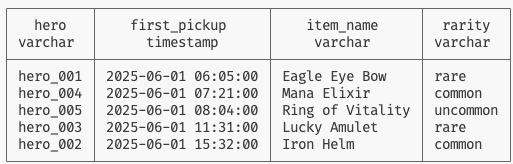


<div class="page-break"></div>

## Pattern #2: First Before

**Question**: For each anchor event, what was the *first* occurrence of activity X that happened *before* it?

**Use Case**: *"For each quest completion, what was the first battle the hero fought before completing this quest?"*

### Generic Template

```sql
WITH cohort AS (
    SELECT entity, ts AS cohort_ts, features
    FROM activity_stream
    WHERE activity = '{cohort_activity}'
),
append AS (
    SELECT
        entity,
        ts,
        features,
        ROW_NUMBER() OVER (PARTITION BY entity ORDER BY ts ASC) AS rn
    FROM activity_stream
    WHERE activity = '{append_activity}'
)
SELECT
    c.entity,
    c.cohort_ts,
    a.ts AS first_before_ts,
    a.features
FROM cohort c
LEFT JOIN append a
    ON c.entity = a.entity
    AND a.ts < c.cohort_ts
    AND a.rn = 1;
```

### Fantasy Realm Example

```sql
-- For each quest completion, the first battle fought before it
WITH quest_completions AS (
    SELECT
        entity,
        ts AS completed_ts,
        features->>'quest_id' AS quest_id
    FROM activity_stream
    WHERE activity = 'quest_completed'
),
battles_ranked AS (
    SELECT
        entity,
        ts,
        features->>'enemy_type' AS enemy,
        features->>'location' AS location,
        ROW_NUMBER() OVER (PARTITION BY entity ORDER BY ts ASC) AS rn
    FROM activity_stream
    WHERE activity = 'battle_start'
)
SELECT
    qc.entity AS hero,
    qc.quest_id,
    qc.completed_ts,
    b.ts AS first_battle_ts,
    b.enemy,
    b.location
FROM quest_completions qc
LEFT JOIN battles_ranked b
    ON qc.entity = b.entity
    AND b.ts < qc.completed_ts
    AND b.rn = 1
ORDER BY qc.completed_ts
LIMIT 10;
```

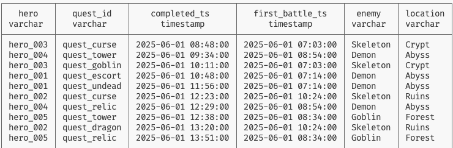


<div class="page-break"></div>

## Pattern #3: First After

**Question**: For each anchor event, what was the *first* occurrence of activity X that happened *after* it?

**Use Case**: *"For each dungeon entry, what was the first item found after entering?"*

### Generic Template

```sql
WITH cohort AS (
    SELECT entity, ts AS cohort_ts, features
    FROM activity_stream
    WHERE activity = '{cohort_activity}'
),
append AS (
    SELECT entity, ts, features
    FROM activity_stream
    WHERE activity = '{append_activity}'
),
append_ranked AS (
    SELECT
        c.entity,
        c.cohort_ts,
        a.ts,
        a.features,
        ROW_NUMBER() OVER (
            PARTITION BY c.entity, c.cohort_ts
            ORDER BY a.ts ASC
        ) AS rn
    FROM cohort c
    LEFT JOIN append a
        ON c.entity = a.entity
        AND a.ts > c.cohort_ts
)
SELECT entity, cohort_ts, ts AS first_after_ts, features
FROM append_ranked
WHERE rn = 1;
```

### Fantasy Realm Example

```sql
-- For each dungeon entry, the first item picked up after entering
WITH dungeon_entries AS (
    SELECT
        entity,
        ts AS entered_ts,
        features->>'dungeon_name' AS dungeon
    FROM activity_stream
    WHERE activity = 'dungeon_enter'
),
items AS (
    SELECT
        entity,
        ts,
        features->>'item_name' AS item_name,
        features->>'item_rarity' AS rarity
    FROM activity_stream
    WHERE activity = 'item_pickup'
),
items_ranked AS (
    SELECT
        de.entity,
        de.dungeon,
        de.entered_ts,
        i.ts,
        i.item_name,
        i.rarity,
        ROW_NUMBER() OVER (
            PARTITION BY de.entity, de.entered_ts
            ORDER BY i.ts ASC
        ) AS rn
    FROM dungeon_entries de
    LEFT JOIN items i
        ON de.entity = i.entity
        AND i.ts > de.entered_ts
)
SELECT
    entity AS hero,
    dungeon,
    entered_ts,
    ts AS first_item_ts,
    item_name,
    rarity
FROM items_ranked
WHERE rn = 1
ORDER BY entered_ts
LIMIT 10;
```

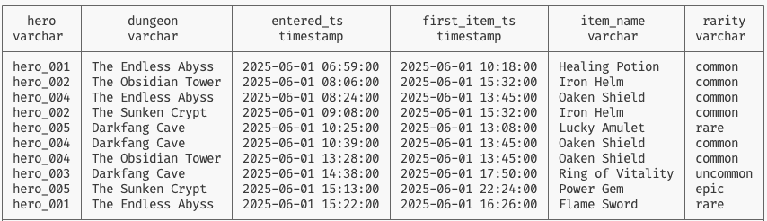


<div class="page-break"></div>

## Pattern #4: First Between

**Question**: For each pair of start/end events, what was the *first* occurrence of activity X *between* them?

**Use Case**: *"For each quest accepted, what was the first battle fought before completing it?"*

### Generic Template

```sql
WITH intervals AS (
    SELECT
        s.entity,
        s.ts AS start_ts,
        e.ts AS end_ts,
        s.features AS start_features,
        e.features AS end_features
    FROM activity_stream s
    JOIN activity_stream e
      ON s.entity = e.entity
      AND s.activity = '{start_activity}'
      AND e.activity = '{end_activity}'
      AND e.ts > s.ts
),
append AS (
    SELECT entity, ts, features
    FROM activity_stream
    WHERE activity = '{append_activity}'
),
append_ranked AS (
    SELECT
        i.entity,
        i.start_ts,
        i.end_ts,
        i.start_features,
        i.end_features,
        a.ts,
        a.features,
        ROW_NUMBER() OVER (
            PARTITION BY i.entity, i.start_ts
            ORDER BY a.ts ASC
        ) AS rn
    FROM intervals i
    LEFT JOIN append a
        ON i.entity = a.entity
        AND a.ts > i.start_ts
        AND a.ts < i.end_ts
)
SELECT entity, start_ts, end_ts, start_features, end_features,
       ts AS first_between_ts, features
FROM append_ranked
WHERE rn = 1;
```

### Fantasy Realm Example

```sql
-- For each quest lifecycle (accepted → completed), find first battle
WITH quest_starts AS (
    SELECT
        entity,
        ts AS accepted_ts,
        features->>'quest_id' AS quest_id,
        features->>'quest_name' AS quest_name
    FROM activity_stream
    WHERE activity = 'quest_accepted'
),
quest_ends AS (
    SELECT
        entity,
        ts AS completed_ts,
        features->>'quest_id' AS quest_id
    FROM activity_stream
    WHERE activity = 'quest_completed'
),
quest_intervals AS (
    SELECT
        qs.entity,
        qs.quest_name,
        qs.accepted_ts,
        qe.completed_ts
    FROM quest_starts qs
    JOIN quest_ends qe
      ON qs.entity = qe.entity
      AND qs.quest_id = qe.quest_id
      AND qe.completed_ts > qs.accepted_ts
),
battles AS (
    SELECT
        entity,
        ts,
        features->>'enemy_type' AS enemy
    FROM activity_stream
    WHERE activity = 'battle_start'
),
battles_ranked AS (
    SELECT
        qi.entity,
        qi.quest_name,
        qi.accepted_ts,
        qi.completed_ts,
        b.ts,
        b.enemy,
        ROW_NUMBER() OVER (
            PARTITION BY qi.entity, qi.accepted_ts
            ORDER BY b.ts ASC
        ) AS rn
    FROM quest_intervals qi
    LEFT JOIN battles b
        ON qi.entity = b.entity
        AND b.ts > qi.accepted_ts
        AND b.ts < qi.completed_ts
)
SELECT
    entity AS hero,
    quest_name,
    accepted_ts,
    completed_ts,
    ts AS first_battle_ts,
    enemy
FROM battles_ranked
WHERE rn = 1
ORDER BY accepted_ts
LIMIT 10;
```

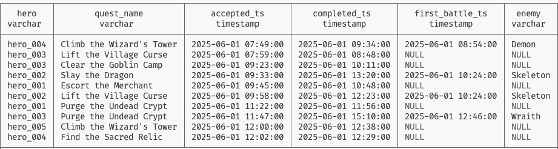

<div class="page-break"></div>

## Pattern #5: Last Ever

**Question**: For each entity, what was the *most recent* occurrence of activity X?

**Use Case**: *"For each hero, what was their most recent level up?"*

### Generic Template

```sql
WITH ranked AS (
    SELECT
        entity,
        ts,
        features,
        ROW_NUMBER() OVER (PARTITION BY entity ORDER BY ts DESC) AS rn
    FROM activity_stream
    WHERE activity = '{target_activity}'
)
SELECT entity, ts, features
FROM ranked
WHERE rn = 1;
```

### Fantasy Realm Example

```sql
-- Most recent level up for each hero
WITH ranked AS (
    SELECT
        entity,
        ts,
        features->>'new_level' AS level,
        features->>'class' AS class,
        ROW_NUMBER() OVER (PARTITION BY entity ORDER BY ts DESC) AS rn
    FROM activity_stream
    WHERE activity = 'level_up'
)
SELECT
    entity AS hero,
    ts AS level_up_time,
    level,
    class
FROM ranked
WHERE rn = 1
ORDER BY ts DESC;
```

**Result** shows each hero's current level and when they last leveled up.

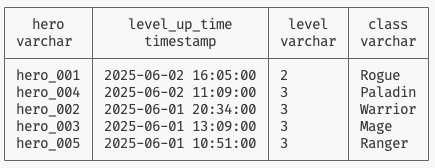

<div class="page-break"></div>

## Pattern #6: Last Before

**Question**: For each anchor event, what was the *most recent* occurrence of activity X *before* it?

**Use Case**: *"For each battle start, what was the last item picked up before combat?"*

### Generic Template

```sql
WITH cohort AS (
    SELECT entity, ts AS cohort_ts, features
    FROM activity_stream
    WHERE activity = '{cohort_activity}'
),
append AS (
    SELECT entity, ts, features
    FROM activity_stream
    WHERE activity = '{append_activity}'
),
append_ranked AS (
    SELECT
        c.entity,
        c.cohort_ts,
        c.features AS cohort_features,
        a.ts,
        a.features,
        ROW_NUMBER() OVER (
            PARTITION BY c.entity, c.cohort_ts
            ORDER BY a.ts DESC
        ) AS rn
    FROM cohort c
    LEFT JOIN append a
        ON c.entity = a.entity
        AND a.ts < c.cohort_ts
)
SELECT entity, cohort_ts, ts AS last_before_ts, features
FROM append_ranked
WHERE rn = 1;
```

### Fantasy Realm Example

```sql
-- For each battle, the last item picked up before fighting
WITH battles AS (
    SELECT
        entity,
        ts AS battle_ts,
        features->>'enemy_type' AS enemy,
        features->>'location' AS location
    FROM activity_stream
    WHERE activity = 'battle_start'
),
items AS (
    SELECT
        entity,
        ts,
        features->>'item_name' AS item_name
    FROM activity_stream
    WHERE activity = 'item_pickup'
),
items_ranked AS (
    SELECT
        b.entity,
        b.enemy,
        b.location,
        b.battle_ts,
        i.ts,
        i.item_name,
        ROW_NUMBER() OVER (
            PARTITION BY b.entity, b.battle_ts
            ORDER BY i.ts DESC
        ) AS rn
    FROM battles b
    LEFT JOIN items i
        ON b.entity = i.entity
        AND i.ts < b.battle_ts
)
SELECT
    entity AS hero,
    enemy,
    location,
    battle_ts,
    ts AS last_item_ts,
    item_name,
    EXTRACT(EPOCH FROM (battle_ts - ts))/60 AS minutes_since_pickup
FROM items_ranked
WHERE rn = 1
ORDER BY battle_ts
LIMIT 10;
```

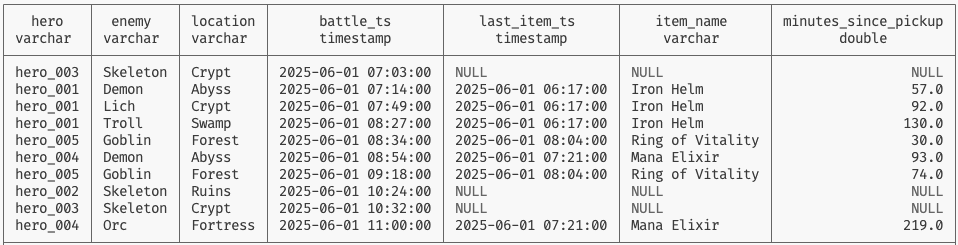


<div class="page-break"></div>

## Pattern #7: Last After

**Question**: For each anchor event, what was the *most recent* occurrence of activity X *after* it?

**Use Case**: *"For each quest accepted, what was the last battle outcome after accepting?"*

### Generic Template

```sql
WITH cohort AS (
    SELECT entity, ts AS cohort_ts, features
    FROM activity_stream
    WHERE activity = '{cohort_activity}'
),
append AS (
    SELECT entity, ts, features
    FROM activity_stream
    WHERE activity = '{append_activity}'
),
append_ranked AS (
    SELECT
        c.entity,
        c.cohort_ts,
        a.ts,
        a.features,
        ROW_NUMBER() OVER (
            PARTITION BY c.entity, c.cohort_ts
            ORDER BY a.ts DESC
        ) AS rn
    FROM cohort c
    LEFT JOIN append a
        ON c.entity = a.entity
        AND a.ts > c.cohort_ts
)
SELECT entity, cohort_ts, ts AS last_after_ts, features
FROM append_ranked
WHERE rn = 1;
```

### Fantasy Realm Example

```sql
-- For each quest accepted, the last battle fought afterward
WITH quests AS (
    SELECT
        entity,
        ts AS accepted_ts,
        features->>'quest_name' AS quest_name
    FROM activity_stream
    WHERE activity = 'quest_accepted'
),
battle_outcomes AS (
    SELECT
        entity,
        ts,
        features->>'outcome' AS outcome,
        features->>'damage_taken' AS damage
    FROM activity_stream
    WHERE activity = 'battle_end'
),
battles_ranked AS (
    SELECT
        q.entity,
        q.quest_name,
        q.accepted_ts,
        bo.ts,
        bo.outcome,
        bo.damage,
        ROW_NUMBER() OVER (
            PARTITION BY q.entity, q.accepted_ts
            ORDER BY bo.ts DESC
        ) AS rn
    FROM quests q
    LEFT JOIN battle_outcomes bo
        ON q.entity = bo.entity
        AND bo.ts > q.accepted_ts
)
SELECT
    entity AS hero,
    quest_name,
    accepted_ts,
    ts AS last_battle_ts,
    outcome,
    damage
FROM battles_ranked
WHERE rn = 1
ORDER BY accepted_ts
LIMIT 10;
```

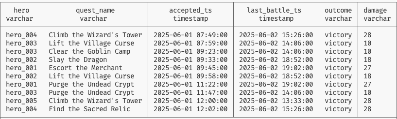


<div class="page-break"></div>

## Pattern #8: Last Between

**Question**: For each pair of start/end events, what was the *last* occurrence of activity X *between* them?

**Use Case**: *"For each dungeon visit, what was the last battle fought before exiting?"*

### Generic Template

```sql
WITH intervals AS (
    SELECT
        s.entity,
        s.ts AS start_ts,
        e.ts AS end_ts,
        s.features AS start_features
    FROM activity_stream s
    JOIN activity_stream e
      ON s.entity = e.entity
      AND s.activity = '{start_activity}'
      AND e.activity = '{end_activity}'
      AND e.ts > s.ts
),
append AS (
    SELECT entity, ts, features
    FROM activity_stream
    WHERE activity = '{append_activity}'
),
append_ranked AS (
    SELECT
        i.entity,
        i.start_ts,
        i.end_ts,
        i.start_features,
        a.ts,
        a.features,
        ROW_NUMBER() OVER (
            PARTITION BY i.entity, i.start_ts
            ORDER BY a.ts DESC
        ) AS rn
    FROM intervals i
    LEFT JOIN append a
        ON i.entity = a.entity
        AND a.ts > i.start_ts
        AND a.ts < i.end_ts
)
SELECT entity, start_ts, end_ts, start_features,
       ts AS last_between_ts, features
FROM append_ranked
WHERE rn = 1;
```

### Fantasy Realm Example

```sql
-- For each dungeon visit, the last battle before leaving
WITH dungeon_enters AS (
    SELECT
        entity,
        ts AS enter_ts,
        features->>'dungeon_name' AS dungeon
    FROM activity_stream
    WHERE activity = 'dungeon_enter'
),
dungeon_exits AS (
    SELECT
        entity,
        ts AS exit_ts
    FROM activity_stream
    WHERE activity = 'dungeon_exit'
),
visits AS (
    SELECT
        de.entity,
        de.dungeon,
        de.enter_ts,
        MIN(dx.exit_ts) AS exit_ts
    FROM dungeon_enters de
    JOIN dungeon_exits dx
      ON de.entity = dx.entity
      AND dx.exit_ts > de.enter_ts
    GROUP BY de.entity, de.dungeon, de.enter_ts
),
battles AS (
    SELECT
        entity,
        ts,
        features->>'enemy_type' AS enemy,
        features->>'outcome' AS outcome
    FROM activity_stream
    WHERE activity = 'battle_end'
),
battles_ranked AS (
    SELECT
        v.entity,
        v.dungeon,
        v.enter_ts,
        v.exit_ts,
        b.ts,
        b.enemy,
        b.outcome,
        ROW_NUMBER() OVER (
            PARTITION BY v.entity, v.enter_ts
            ORDER BY b.ts DESC
        ) AS rn
    FROM visits v
    LEFT JOIN battles b
        ON v.entity = b.entity
        AND b.ts > v.enter_ts
        AND b.ts < v.exit_ts
)
SELECT
    entity AS hero,
    dungeon,
    enter_ts,
    exit_ts,
    ts AS last_battle_ts,
    enemy,
    outcome
FROM battles_ranked
WHERE rn = 1
ORDER BY enter_ts
LIMIT 10;
```

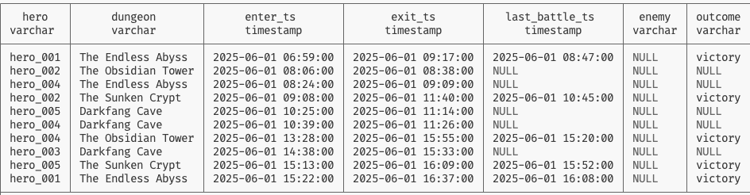


<div class="page-break"></div>

## Pattern #9: Aggregate Ever

**Question**: For each entity, what are aggregate statistics for activity X across all time?

**Use Case**: *"For each hero, how many total battles have they fought?"*

### Generic Template

```sql
SELECT
    entity,
    COUNT(*) AS total_count,
    MIN(ts) AS first_occurrence,
    MAX(ts) AS last_occurrence
FROM activity_stream
WHERE activity = '{target_activity}'
GROUP BY entity;
```

### Fantasy Realm Example

```sql
-- Battle statistics for each hero
SELECT
    entity AS hero,
    COUNT(*) AS total_battles,
    SUM(CASE WHEN features->>'outcome' = 'victory' THEN 1 ELSE 0 END) AS victories,
    SUM(CASE WHEN features->>'outcome' = 'retreat' THEN 1 ELSE 0 END) AS retreats,
    ROUND(100.0 * SUM(CASE WHEN features->>'outcome' = 'victory' THEN 1 ELSE 0 END) / COUNT(*), 1) AS win_rate,
    AVG((features->>'damage_taken')::INT) AS avg_damage,
    MIN(ts) AS first_battle,
    MAX(ts) AS last_battle
FROM activity_stream
WHERE activity = 'battle_end'
GROUP BY entity
ORDER BY total_battles DESC;
```

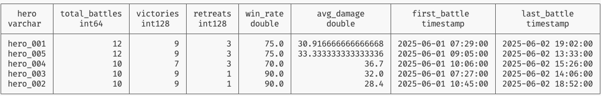


<div class="page-break"></div>

## Pattern #10: Aggregate Before

**Question**: For each anchor event, what are aggregate statistics for activity X *before* it?

**Use Case**: *"For each level up, how many quests were completed before reaching this level?"*

### Generic Template

```sql
WITH cohort AS (
    SELECT entity, ts AS cohort_ts, features
    FROM activity_stream
    WHERE activity = '{cohort_activity}'
),
append AS (
    SELECT entity, ts, features
    FROM activity_stream
    WHERE activity = '{append_activity}'
)
SELECT
    c.entity,
    c.cohort_ts,
    c.features,
    COUNT(a.ts) AS count_before
FROM cohort c
LEFT JOIN append a
  ON a.entity = c.entity
  AND a.ts < c.cohort_ts
GROUP BY c.entity, c.cohort_ts, c.features;
```

### Fantasy Realm Example

```sql
-- For each level up, count quests completed beforehand
WITH level_ups AS (
    SELECT
        entity,
        ts AS level_ts,
        features->>'new_level' AS new_level,
        features->>'class' AS class
    FROM activity_stream
    WHERE activity = 'level_up'
),
quests AS (
    SELECT
        entity,
        ts,
        (features->>'xp_gained')::INT AS xp
    FROM activity_stream
    WHERE activity = 'quest_completed'
)
SELECT
    lu.entity AS hero,
    lu.new_level,
    lu.class,
    lu.level_ts,
    COUNT(q.ts) AS quests_completed_before,
    COALESCE(SUM(q.xp), 0) AS total_xp_before
FROM level_ups lu
LEFT JOIN quests q
  ON q.entity = lu.entity
  AND q.ts < lu.level_ts
GROUP BY lu.entity, lu.new_level, lu.class, lu.level_ts
ORDER BY lu.level_ts;
```

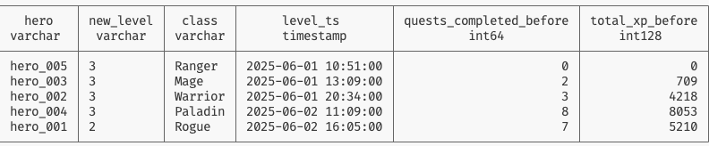

<div class="page-break"></div>

## Pattern #11: Aggregate After

**Question**: For each anchor event, what are aggregate statistics for activity X *after* it?

**Use Case**: *"For each quest accepted, how many items were picked up after starting?"*

### Generic Template

```sql
WITH cohort AS (
    SELECT entity, ts AS cohort_ts, features
    FROM activity_stream
    WHERE activity = '{cohort_activity}'
),
append AS (
    SELECT entity, ts, features
    FROM activity_stream
    WHERE activity = '{append_activity}'
)
SELECT
    c.entity,
    c.cohort_ts,
    c.features,
    COUNT(a.ts) AS count_after
FROM cohort c
LEFT JOIN append a
  ON a.entity = c.entity
  AND a.ts > c.cohort_ts
GROUP BY c.entity, c.cohort_ts, c.features;
```

### Fantasy Realm Example

```sql
-- For each quest accepted, count items found afterward
WITH quests AS (
    SELECT
        entity,
        ts AS accepted_ts,
        features->>'quest_name' AS quest_name,
        features->>'difficulty' AS difficulty
    FROM activity_stream
    WHERE activity = 'quest_accepted'
),
items AS (
    SELECT
        entity,
        ts,
        features->>'item_rarity' AS rarity
    FROM activity_stream
    WHERE activity = 'item_pickup'
)
SELECT
    q.entity AS hero,
    q.quest_name,
    q.difficulty,
    q.accepted_ts,
    COUNT(i.ts) AS items_found_after,
    SUM(CASE WHEN i.rarity IN ('rare', 'epic') THEN 1 ELSE 0 END) AS rare_items_after
FROM quests q
LEFT JOIN items i
  ON i.entity = q.entity
  AND i.ts > q.accepted_ts
GROUP BY q.entity, q.quest_name, q.difficulty, q.accepted_ts
ORDER BY items_found_after DESC
LIMIT 10;
```

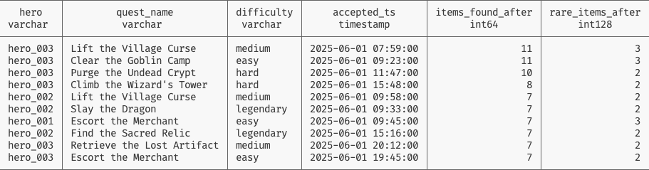

<div class="page-break"></div>

## Pattern #12: Aggregate Between

**Question**: For each pair of start/end events, what are aggregate statistics for activity X *between* them?

**Use Case**: *"For each dungeon visit, how many battles occurred inside?"*

### Generic Template

```sql
WITH intervals AS (
    SELECT
        s.entity,
        s.ts AS start_ts,
        e.ts AS end_ts,
        s.features AS start_features
    FROM activity_stream s
    JOIN activity_stream e
      ON s.entity = e.entity
      AND s.activity = '{start_activity}'
      AND e.activity = '{end_activity}'
      AND e.ts > s.ts
),
append AS (
    SELECT entity, ts, features
    FROM activity_stream
    WHERE activity = '{append_activity}'
)
SELECT
    i.entity,
    i.start_ts,
    i.end_ts,
    i.start_features,
    COUNT(a.ts) AS count_between
FROM intervals i
LEFT JOIN append a
  ON a.entity = i.entity
  AND a.ts > i.start_ts
  AND a.ts < i.end_ts
GROUP BY i.entity, i.start_ts, i.end_ts, i.start_features;
```

### Fantasy Realm Example

```sql
-- For each dungeon visit, count battles inside
WITH dungeon_enters AS (
    SELECT
        entity,
        ts AS enter_ts,
        features->>'dungeon_name' AS dungeon,
        features->>'dungeon_tier' AS tier
    FROM activity_stream
    WHERE activity = 'dungeon_enter'
),
dungeon_exits AS (
    SELECT
        entity,
        ts AS exit_ts,
        (features->>'loot_count')::INT AS loot_count,
        (features->>'time_spent_minutes')::INT AS time_spent
    FROM activity_stream
    WHERE activity = 'dungeon_exit'
),
exits_ranked AS (
    SELECT
        de.entity,
        de.dungeon,
        de.tier,
        de.enter_ts,
        dx.exit_ts,
        dx.loot_count,
        dx.time_spent,
        ROW_NUMBER() OVER (
            PARTITION BY de.entity, de.enter_ts
            ORDER BY dx.exit_ts ASC
        ) AS rn
    FROM dungeon_enters de
    JOIN dungeon_exits dx
        ON de.entity = dx.entity
        AND dx.exit_ts > de.enter_ts
),
visits AS (
    SELECT entity, dungeon, tier, enter_ts, exit_ts, loot_count, time_spent
    FROM exits_ranked
    WHERE rn = 1
),
battles AS (
    SELECT
        entity,
        ts,
        features->>'outcome' AS outcome
    FROM activity_stream
    WHERE activity = 'battle_end'
)
SELECT
    v.entity AS hero,
    v.dungeon,
    v.tier,
    v.enter_ts,
    v.exit_ts,
    v.time_spent AS minutes_inside,
    v.loot_count,
    COUNT(b.ts) AS battles_fought,
    SUM(CASE WHEN b.outcome = 'victory' THEN 1 ELSE 0 END) AS victories
FROM visits v
LEFT JOIN battles b
  ON b.entity = v.entity
  AND b.ts > v.enter_ts
  AND b.ts < v.exit_ts
GROUP BY v.entity, v.dungeon, v.tier, v.enter_ts, v.exit_ts, v.time_spent, v.loot_count
ORDER BY battles_fought DESC
LIMIT 10;
```

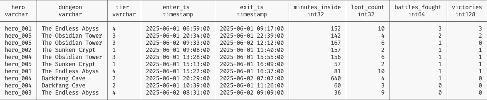

<div class="page-break"></div>

## Quick Reference

### Pattern Selection Guide

| If you need... | Use Pattern |
|----------------|-------------|
| First ever X | #1 First Ever |
| First X before cohort | #2 First Before |
| First X after cohort | #3 First After |
| First X during interval | #4 First Between |
| Most recent X ever | #5 Last Ever |
| Most recent X before cohort | #6 Last Before |
| Most recent X after cohort | #7 Last After |
| Most recent X during interval | #8 Last Between |
| Count/sum all X | #9 Aggregate Ever |
| Count/sum X before cohort | #10 Aggregate Before |
| Count/sum X after cohort | #11 Aggregate After |
| Count/sum X during interval | #12 Aggregate Between |

### Key Syntax Elements

```sql
-- First: ROW_NUMBER() ... ORDER BY ts ASC, then WHERE rn = 1
-- Last: ROW_NUMBER() ... ORDER BY ts DESC, then WHERE rn = 1
-- Before: AND a.ts < c.cohort_ts
-- After: AND a.ts > c.cohort_ts
-- Between: AND a.ts > start_ts AND a.ts < end_ts
-- Aggregate: COUNT(*), SUM(), AVG(), etc.
```

<div class="page-break"></div>

### The Cohort/Append Pattern

All First/Last patterns use the same structure:

```sql
WITH cohort AS (
    -- Your anchor events (what you're enriching)
    SELECT entity, ts AS cohort_ts, features
    FROM activity_stream
    WHERE activity = 'cohort_activity'
),
append_ranked AS (
    -- Events to join, ranked per cohort row
    SELECT
        c.entity,
        c.cohort_ts,
        a.ts,
        a.features,
        ROW_NUMBER() OVER (
            PARTITION BY c.entity, c.cohort_ts
            ORDER BY a.ts ASC    -- ASC for First, DESC for Last
        ) AS rn
    FROM cohort c
    LEFT JOIN activity_stream a
        ON c.entity = a.entity
        AND a.activity = 'append_activity'
        AND a.ts < c.cohort_ts   -- Before/After/Between filter
)
SELECT * FROM append_ranked WHERE rn = 1;
```
